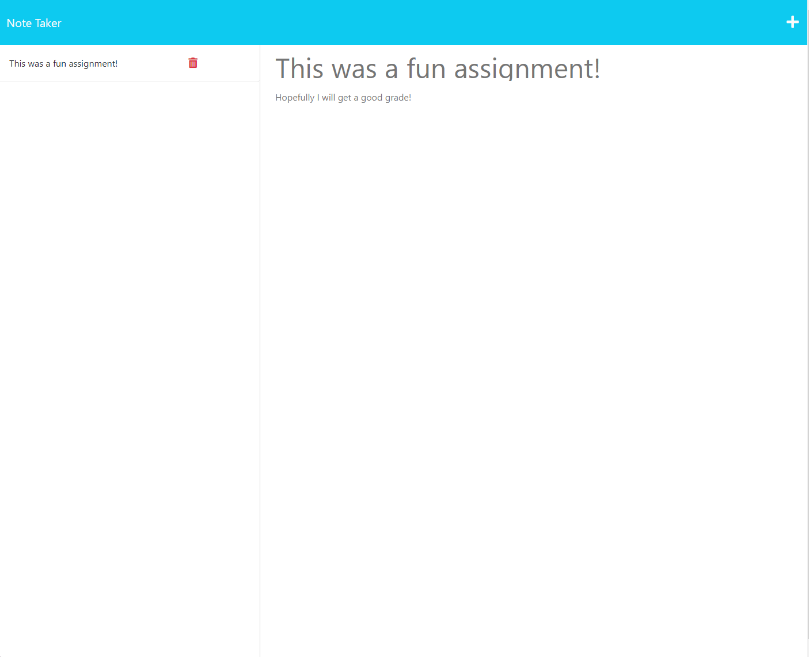

# Note Taker Application

[Link to my project](https://pacific-wildwood-35009.herokuapp.com/)

## Table of Contents
- [Description](#description-of-project)
- [Questions](#questions)
- [Visuals](#visuals)

## Description of project

This application was created to demonstrate how we can leverage the Express module in Node to run a dynamic web application. When the title and body of a note is added, and the save icon is clicked, it will persist in the left hand column. From here, you can click on that saved note at any time to redisplay it. Now we can all keep track of our notes and stay organized!

## Questions
  
  If you have any questions about this project, please feel free to email me at smoke5643@gmail.com or on Github at https://www.github.com/Smoke5643. I will do my best to get back to you as soon as possible!

## Visuals

Preview of Application

